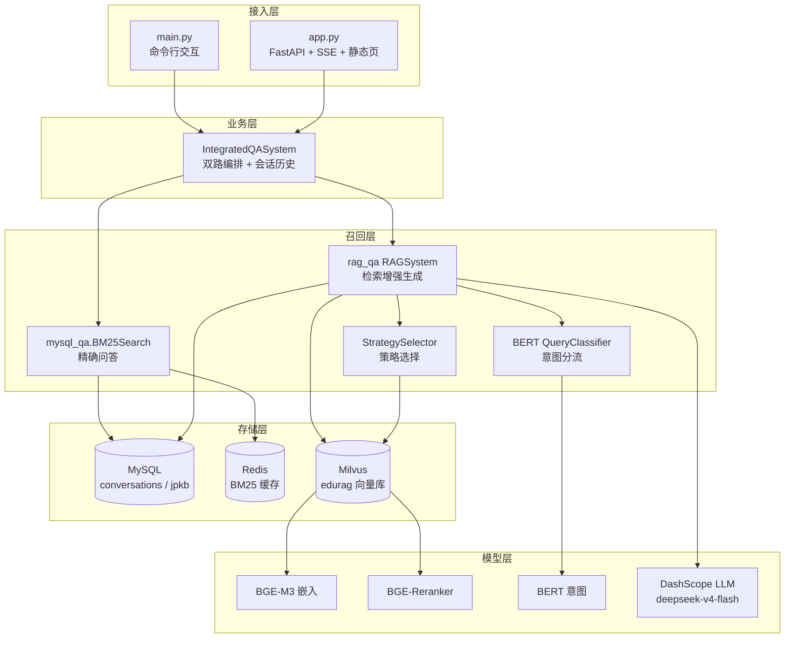
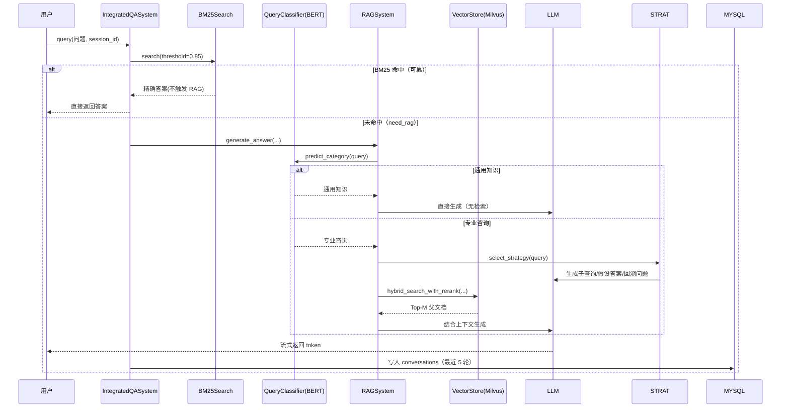
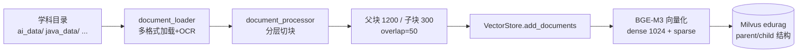

# 系统架构

本文档说明 EduRAG 的整体分层、查询数据流与索引构建流程。

## 1. 分层架构



## 2. 查询数据流（在线问答）



要点：
- **BM25 优先**：相似度（Softmax 归一化）≥ 0.85 视为可靠命中，直接返回，避免无谓调用大模型。
- **意图分流**：`通用知识` 跳过检索，直接由 LLM 回答；`专业咨询` 进入 RAG 检索增强流程。
- **策略选择**：由 LLM 在「直接检索 / HyDE / 子查询 / 回溯问题检索」四种增强策略中择一。
- **流式 + 历史**：RAG 答案以生成器（token 流）方式返回；每轮问答写入 MySQL，仅保留最近 5 轮。

## 3. 索引构建流程（离线入库）



要点：
- 目录名决定 `source` 学科标签（如 `ai_data` → `ai`）。
- 采用**父子块（parent/child）**结构：检索时用子块召回，返回时还原为父块内容，兼顾召回精度与上下文完整性。
- 文档块写入 Milvus 字段：`id / text / dense_vector / sparse_vector / parent_id / parent_content / source / timestamp`。

## 4. 关键依赖链说明

`rag_qa/__init__.py` 导出：

```python
from .core.vector_store import VectorStack   # 实际为 VectorStore
from .core.new_rag_system import RAGSystem
```

因此 `main.py` 中的 `from rag_qa import VectorStore, RAGSystem` 实际绑定的是：
- **`VectorStore`**（`core/vector_store.py`，依赖 `milvus_model`、`pymilvus`、`sentence_transformers`、`torch`）
- **`RAGSystem`**（`core/new_rag_system.py`，支持流式生成 + 对话历史，是主链路使用的版本）

> ⚠️ 注意：`core/rag_system.py` 是**旧版** `RAGSystem`（非流式、历史在 `main.py` 中维护），当前主链路不使用它，仅作参考。
> 由于 `vector_store.py` 在模块顶层 `import milvus_model`，**任何 `import rag_qa` 都会连带加载重依赖**，需确保完整环境就绪。

## 5. 配置与部署关系

- 所有连接信息集中在 `config.ini`（`mysql` / `redis` / `milvus` / `llm` / `retrieval` / `app` / `logger`）。
- LLM API Key 通过环境变量 `ALIYUN_API_KEY` 注入（`base/config.py` 读取），`config.ini` 的 `dashscope_api_key` 字段留空。
- Milvus + Redis 由 `docker/milvus_redis/docker-compose.yml` 一键拉起（etcd + minio + milvus + redis）。

详见 [04-快速开始与部署.md](./04-快速开始与部署.md)。
