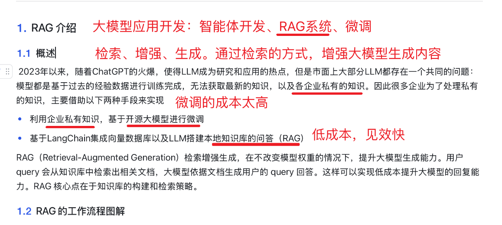
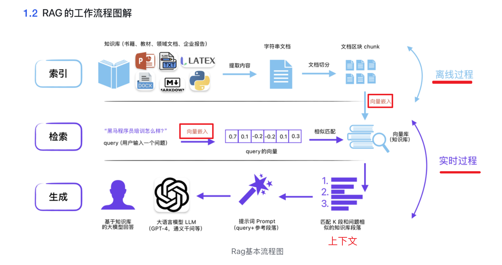
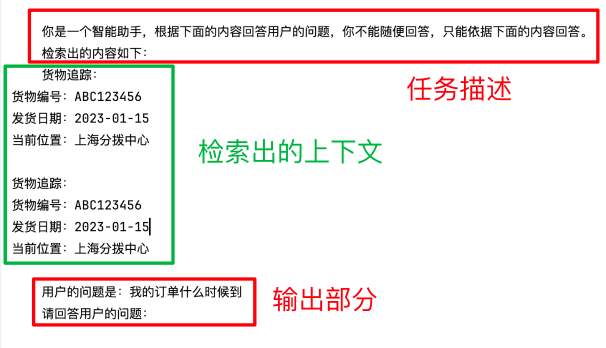

## RAG基本概念



## RAG的基本流程



## RAG的物流查询项目

### 项目模块

```
├── chroma # 向量库
├── data # 数据集
│   └── 物流信息.pdf
├── db.py # 根据语料创建向量库
├── main.py # 运行主函数
├── model.py # 模型文件 包括大模型的和embedding模型
└── web_qa.py # 对话页面
```

### 项目的构建

* create_db.py创建向量数据库
    * 本地知识文件加载，读取
    * 文本切分
    * 向量化
    * 存向量库

* db.py
    * 封装了向量模型和推理大模型
* main.py
    * query 向量化
    * 在文本向量中匹配出与问句向量相似的top_k个
    * 匹配出的文本作为上下文和问题一起添加到prompt中
    * 提交给LLM生成答案

最终的输出：

